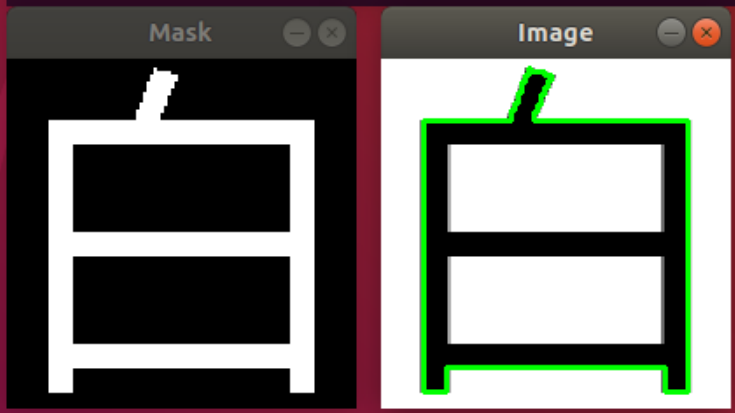
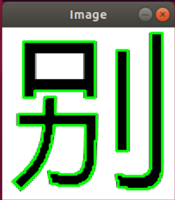
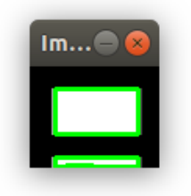
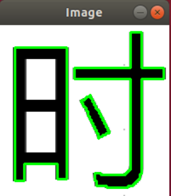
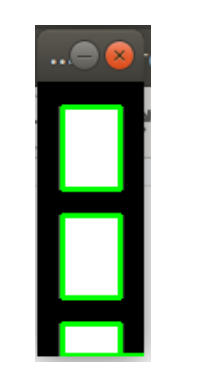

# Towards recognizing radicals in Chinese characters

A few years ago I lived and worked in China.  One of the best parts of this adventure was studying Mandarin.  As an adult learner, it seemed overwhelming to learn the 8,000 characters that an educated Chinese native would know.  So I focused on learning 800 characters required to pass the [HSK I Chinese language proficiency exam](http://www.chinesetest.cn/gosign.do?id=1&lid=0).  The first problem I encountered was how to use a Chinese dictionary?

I discovered that [radicals or classifiers](https://en.wikipedia.org/wiki/Radical_(Chinese_characters)) are the building blocks of Mandarin.  They are used to lookup Chinese characters in a Chinese dictionary.  A Chinese dictionary lists characters by the position of their radicals.  For example, all of the characters with kou3 (one rectangle) on the left-side will be listed together.  

Let's look at three radicals:  kou3 (mouth)  looks like a rectangle, ri2 (sun or day) looks like two stacked rectangles, and mu4 (eye) looks like three stacked rectangles.  

 kou3
 ri2
 mu4

Kou3, ri2, and mu4 are [pinyin](https://en.wikipedia.org/wiki/Pinyin) words.  Pinyin is used to describe how the character sounds.  It is helpful for typing Chinese.  For example, you can use pinyin to search Baidu, the Chinese search engine.  You can also use pinyin to lookup Chinese characters online.  But what if you don't know pinyin?  

**How can we automate identifying Chinese characters using images of simplified Chinese?**

I took Adrian's challenge to learn beginning image processing in a weekend.  My result is this demo showing how to find the kou3, ri2, and mu4 radicals in these characters:  bai2 (white), bie2 (other), zan2 (we), ru2 (if), shi2 (hour), and zi4 (self).  These definitions are over-simplified but give some context of how these characters are used.  In order to find a radical, I looked for black or white rectangles.


It looks like bai2 contains ri2 but the mark at the top is attached so it does not


bie2 - kou3 is found in the top-left quadrant


zan2 - kou3 is found on the left side


ru2 - kou3 is found on the right side


shi2 - ri2 is found on the left side


For purposes of this demo, mu4 is not found in zi4 because of the attached mark at the top

**How did I learn?**

I went to https://www.pyimagesearch.com/start-here/#how_do_i_get_started and completed Steps 1 through 3. Then, I used what I learned.  First, I created black and white images of each character in 200 x 200 pixel png file.  I stored these in the /images folder.  Next, I found the key edge points for each radical and put them in an array.  The arrays are stored in kou.arr, ri.arr, and mu.arr in the /radicals folder.  During processing, I found each shape in each png file.  I stored these arrays in the /radicals/processed folder.

### How it works

First I open the png file and find shapes.  I started with Adrian's sample code for finding-shapes-in-images and contour-extreme-points.  I modified them to extract all the black shapes in the Chinese character being analyzed.  I added a flag so you can choose whether or not to save the array in the /radicals/processed folder.

```
python 01_find_chars.py -i images/imageName.png --saveFile y or n
```

Next, I modified Adrian's shape-detection demo to compare each shape to our three radicals.  If no match is found then, it reports that.  When it finds a shape with an outline that matches a radical, it grabs the shape then looks for white rectangles inside it.  If it finds 2 white rectangles it decides the image is kou3.  Three rectangles matches ri2 and four matches mu4.

```
python 02_detect_kou_ri_mu.py --images images/imageName.png --array radicals/processed/imageName.arr
```

## Results

### bai2 (white)
02_detect_kou_ri_mu.py --images images/bai.png --array radicals/processed/bai.arr



```
radicals/processed/bai1.arr  does not contain kou, ri, or mu
```

### bie2 (other)
02_detect_kou_ri_mu.py --images images/bie.png --array radicals/processed/bie.arr



Notice the script found the 4 black shapes outlined in green.  Each shape will be evaluated to see whether it matches one of our radicals.  Actually, this character only contains three components.  The two "lines" on the right side are not attached but they are considered together.  More preprocessing logic is needed.   Kou3 is in the top left quadrant.  

Since the script found four images, I expected four messages and four files:  bie1, bie2, bie3, and bie4.  Here's the output:

```
 radicals/processed/bie1.arr  does not contain kou3, ri2, or mu4

 radicals/processed/bie2.arr  does not contain kou3, ri2, or mu4
```



```
I found kou in  radicals/processed/bie3.arr
```

Notice, when the script seeks kou3, it looks for two rectangles, as shown highlighted in green

```
 radicals/processed/bie4.arr  does not contain kou3, ri2, or mu4
```
### shi2

02_detect_kou_ri_mu.py --images images/shi.png --array radicals/processed/shi.arr



The script found 3 shapes but there are only two.  Ri2 is on the left and another character is on the right.  Since the script found three shapes, I expected 3 messages:  shi1, shi2, and shi3:

```
 radicals/processed/shi1.arr  does not contain kou3, ri2, or mu4
 ```
 

```
I found ri radicals/processed/shi2.arr

 radicals/processed/shi3.arr  does not contain kou3, ri2, or mu4
```

### Challenges

My host machine is Windows 10.  My work environment is Ubuntu 18.04 LTS running on Oracle VirtualBox.  I inadvertently corrupted my VirtualBox when I attempted to install routine Ubuntu updates.  I could access the machine but I couldn't open the GUI.  Rather than waste time troubleshooting this, I chose to upgrade to the latest version of VirtualBox and rebuild.  It was late and I wasn't paying close attention.  I misspelled "virtualenvs".  Follow Adrian's instructions to the letter!
